# cpplint提取类成员

总目标，
主要是学习cpplint是如何扫描文件的，包括class的嵌套，还有扫描代码风格，正则表达式提取变量什么的。我的任务是在Cpplint这个文件的基础上，进行一些修改，将头文件(公司里已经写好的.h文件)里面的每个class的变量名提取出来，存到字典里，key是class名（有class嵌套就写成class1:class2类似这种？），value是存放变量的一个数组。如果遇到继承 就把父类也扫描一遍，然后把变量名存起来。

本教程需要手边有一份cpplint.py对照查看。虽然教程中会有附图，但不会把所有代码都附上。

假设我们已经大致了解C++的语法。

----
# Main

我们需要寻找cpplint.py中**负责语法解析**的部分。参见"cpplint-副本.py"，这是完整的原版。请勿改动之。

在文件的末尾，有cpplint的入口。但这个入口可能并不涵盖整个文件的所有功能，因为后面了解到，这个main入口主要是命令行调用的时候的程序起始位置，但保不齐这个文件作为一个被import的模块文件还有别的设计。总之先搞清楚main在干嘛。


找到了main的位置：

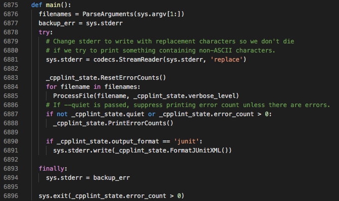

分析其代码，有关stderr的内容暂且略过，因为这是关于异常情形的，我们目前仅关注正常情形。那么我们不难关注到6876行的ParseArguments()和6885行的ProcessFile()。这两个方法很重要。

----
# ParseArguments

看函数的名字，ParseArguments看上去是分析参数的。而sys.argv又是命令行调用时的参数列表，因而推断这里是负责处理命令行调用方式的代码。

命令行调用，大概就是在bash/cmd中这样调用：
```
python cpplint.py file1 file2 file3...
```
其中file1、file2、file3等就是参数。另外，可能还会有以减号'-'或者双减号'--'开头的配置参数，例如```--help```,```--quiet```等。

查找ParseArgument，发现它的定义在6714～6814行。其中罗列了一些配置参数，如图（不全展示）：
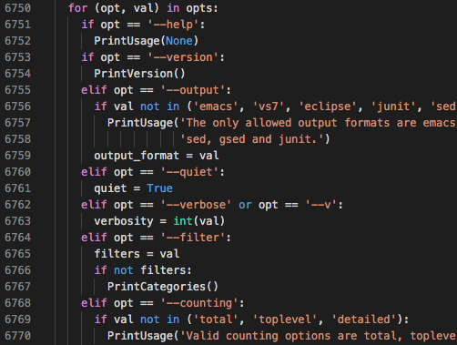

而ParseArgument则是负责分析命令行中除去'python'和'cpplint.py'的其他参数，该改动配置信息的改动配置信息，该记成文件的记进文件列表里面，最后作为函数的返回值返回一个列表（它还排了个序，应该是按字母顺序）：
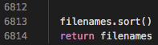

如此分析下来，最重要的便一定是ProcessFile()了。

----
# ProcessFile

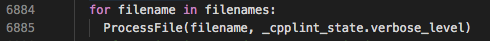

这是main()里面的一段。不难看出，ProcessFile()每次接受一个文件名字符串的输入，并且接受verbose_level这个参数的配置。verbose的本义是“啰嗦的”，这里应该是指输出的重要等级，比如如果这个level设置得很高，那么只有发现了很严重的问题才会显示，不太严重的问题就会被忽略掉。

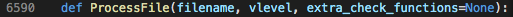

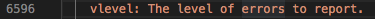

如上图，6596行也给出了解释。

查找到ProcessFile的位置在6590～6680行。

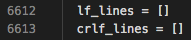

6612～6613行的两个空列表定义，分别叫lf_lines和crlf_lines。lf和crlf分别是两种行尾。ASCII码表中有两个不可见字符，即回车(CR, ASCII 13, \r) 换行(LF, ASCII 10, \n)。有的文本文件的一行会以一个LF结尾，而有的文本文件的一行会以一个CR加上一个LF结尾，甚至有的文本文件会混用，这将导致很多麻烦。所以ProcessFile这里应该是对此有一定的处理吧。

6614～6644行是一个try-except语句，大致看了一下，大致意思是：<br>
如果文件名是'-'，那么就使用stdin（键盘，或者输入输出流）来输入（输入输出流是什么就不用管了，是一种不常用的用法，学习自动化的时候才会用到，手动用不到的），否则就读取文件。把信息存放在lines这个列表里。（6622～6629）<br>
然后，再根据行尾是什么，用lf_lines和crlf_lines记录lines里面哪些行是lf结尾，哪些行是crlf结尾。lf_lines和crlf_lines并不存储文本，只存储文本的行号。这是从```lf_lines.append(linenum + 1)```看出来的。（6633～6638）<br>
一旦出问题就报错退出。（6640～6644）

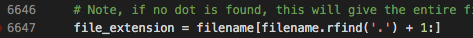

再看6647行（上图），这是要解析文件的扩展名，也就是后缀（像.mp3/.jpg/.cpp/.v/.sv/.py/.pdf这种都叫后缀，也都叫扩展名。不过此处允许出现的没有这么多，因为cpp-lint是给c++用的嘛）。

6651～6674是一个if-else语句。<br>
6651～6653行是说，如果filename拿到的并不是'-'（也就是说并不是走stdin给入文本信息，而是从文件中读取），并且这个文件的扩展名还不在GetAllExtensions()给出的列表里面，那就说明这个文件的扩展名不对，是非法的，比如它可能根本就不是C++文件，不应该被cpp-lint处理，于是报错。<br>
6654～6674行则是在上面的分支没有报错时，进行的操作。<br>
看到6655行，看起来**ProcessFileData**又是一个非常重要的函数，因为凭上下文推断，上文是在作准备，而下文则是在收拾残局，该报错的报错，该输出的输出，所以负责处理的自然是这一条语句了。<br>
6668～6674则是在报错，指出不该用crlf作为行尾。

----
# _ClassInfo

突发奇想，可能代码里面有专门为了class设计的函数，就搜了一下class，搜出来一个类，在2752行，叫"_ClassInfo"，继承自"_BlockInfo"。

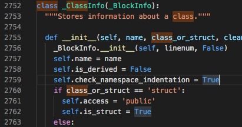

我们之后可能要围绕这个重要的类进行修改。

----

# ProcessFileData

回到正题。之前分析的发现，其余部分都是在围绕着ProcessFileData做一些后勤工作。聚焦到ProcessFileData（6450～6500）。

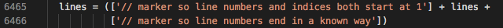

上图，6465～6466行，给lines的头尾各加了一个标记。头加了一个标记，从而行号和index（从零开始的索引。indices是index的复数形式）能够重合（否则第一行的index是0，这样会差一个，不优雅。其实更重要的是容易犯错。）

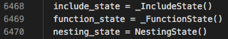

上图三行，分别涉及三个没见过的东西。去查它们的定义：_IncludeState是一个类，看名字大概是排查```#include```语句的吧。_FunctionState也是一个类，看名字大概是排查函数的。<br>
它们之所以以state结尾，可能意味着它们可能是一个工具类，而不是一个存储类。（我自己取的名字）工具类意味着它会反复使用，反复改变自身的成员变量的值，它更多地是集成了一些方法。<br>
NestingState也是一个类，定义在第2896～3267行，非常长，看起来非常重要。之后重点研究。

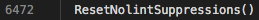

6742行，ResetNolintSuppressions，其定义只有两行，主要是清空了一些全局变量。这也对得起它Reset的名字。

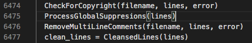

6474～6477行，先是CheckForCopyright，很明显是为了检查权利声明。查看其定义后，发现它并不修改lines的内容，即它并不是一个加工lines的方法。<br>
然后ProcessGlobalSuppresions，（suppresion，禁止。不是两个s的那个词），查了它的定义之后不明所以。似乎是有关一些规则禁止的事情，比如不看某类错误，看某类错误什么的。过于复杂，但很明显并不是核心处理步骤。<br>
下一行，RemoveMultiLineComments，顾名思义，知道它是要去除多行注释（```/* */```）。查其定义，它确实会修改lines，将多行注释的部分的每一行都修改成"/**/"以达到去掉的目的（将它们转换成单行注释），总行数不变。<br>
（但它似乎不能处理这种：
```
void foo(){/*
comments
comments
*/ int x=0;
    return;
}
```
）<br>
不管那么多了。这也不是重点。<br>
然后6477行的```clean_lines = CleansedLines(lines)```是非常重要的一句，clean_lines后来出现在了很多函数中。CleansedLines是一个类，定义在1901行。我们想知道clean_lines到底有多么clean，这对之后的分析一定有帮助。不过先把ProcessFileData先看完吧。

6479～6480行：如果这是一个头文件（.h），那么检查它有没有头文件包含的保护宏定义。不重要。

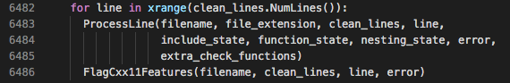

6482～6487行：遍历clean_lines的每一行，对它们使用ProcessLine方法和FlagCxx11Features方法。其中Cxx常常用来表示C++，因为+号不允许出现在标识符里面。<br>
而按照命名规则，ProcessLine方法肯定也是十分重要的。<br>
6487行是在检查是不是有没处理完的Block，如果有，那说明存在语法错误。注意到nesting_state被ProcessLine调用过，它一定在里面被修改过。

6489～6499行均为check开头的方法，应该不会再修改什么。可能会有输出。

忽然明白一件事，以state结尾的类，可能是状态机那种设计。从6482行开始的for循环可以看出，每一行一经ProcessLine执行便不会再回头，因此估计是使用了状态机来完成分析。

现在我们有这么几样东西要查看：
- clean_lines
- NestingState
- ProcessLine

我们需要知道clean_lines有多么clean，需要知道nestingState作为状态机是如何跳转的，需要知道ProcessLine方法都对每一行干了些啥。

----
# clean_lines

先研究一下CleansedLines，再回来处理ProcessFileData。这是一个类，在1901～1993行。既然它叫clean_lines，那我们至少要知道它有多干净。

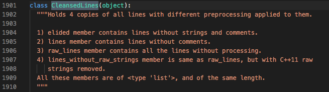

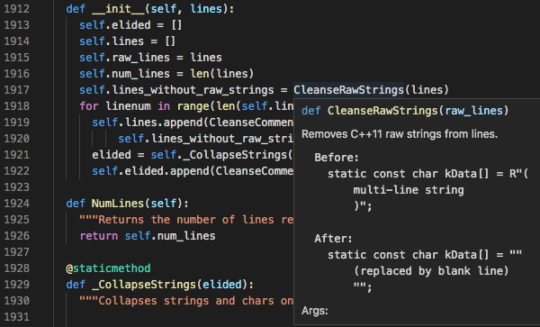

上图，其构造函数init()定义。其中CleanseRawStrings会除掉raw string。至于什么是raw string，只要能想起python正则表达式里经常出现的```r'\s[0-9]'```之类的写法就可以了，它的意义是不转义字符串。通常的字符串是转义的，也就是'\'是不会当作一个单独的字符出现的，会连着后面一个字符被翻译成不可见字符，比如"\n"。这个讲起来就复杂了。目前我们只需要知道它跟我们的最终目的：提取C++类成员变量，没有直接关系。

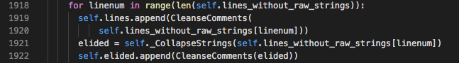

1918～1922行的for循环，又使用CleanseComments去掉了单行注释。

elided：被淘汰的，但在此处可能表达的意思是“已淘洗的”。

一个经过初始化的CleansedLines实例，其成员lines存储的内容去除了所有注释，其成员elided存储的内容去除了所有的注释并且字符串坍缩了。其行数相较原始的lines（未去除多行注释的）而言没有减少。

----

# NestingState

并在ProcessLine中讲

----

# ProcessLine

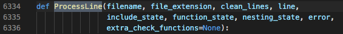

第6334行显示，ProcessLine吃进去三个状态机，吃进去一个clean_lines，吃进去一个表示行号的line，其余的不重要。

6355～6377行

----

可以通过在cmd/shell中运行```pip install cpplint```来安装cpplint进python库中，这样就可以```import cpplint```然后```help(cpplint)```以获得cpplint.py中所有的函数和类以及它们的注释。

----

NestingState类有一个成员叫stack，即栈，其中可以放置_ClassInfo,_NameSpaceInfo,_BlockInfo三种对象的实例，我们认为某行代码肯定有往stack里面放置一个新的_ClassInfo实例的动作。

通过搜索“stack.append”，找到第3161行有这样的动作。仅此一次：

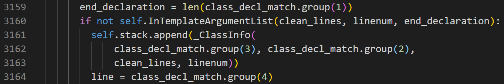

然后阅读上下文。发现这一段代码在Update方法中。

----

重点考察Update。

在第3159行附近，（也可以看看3144的class_decl_match那一行）

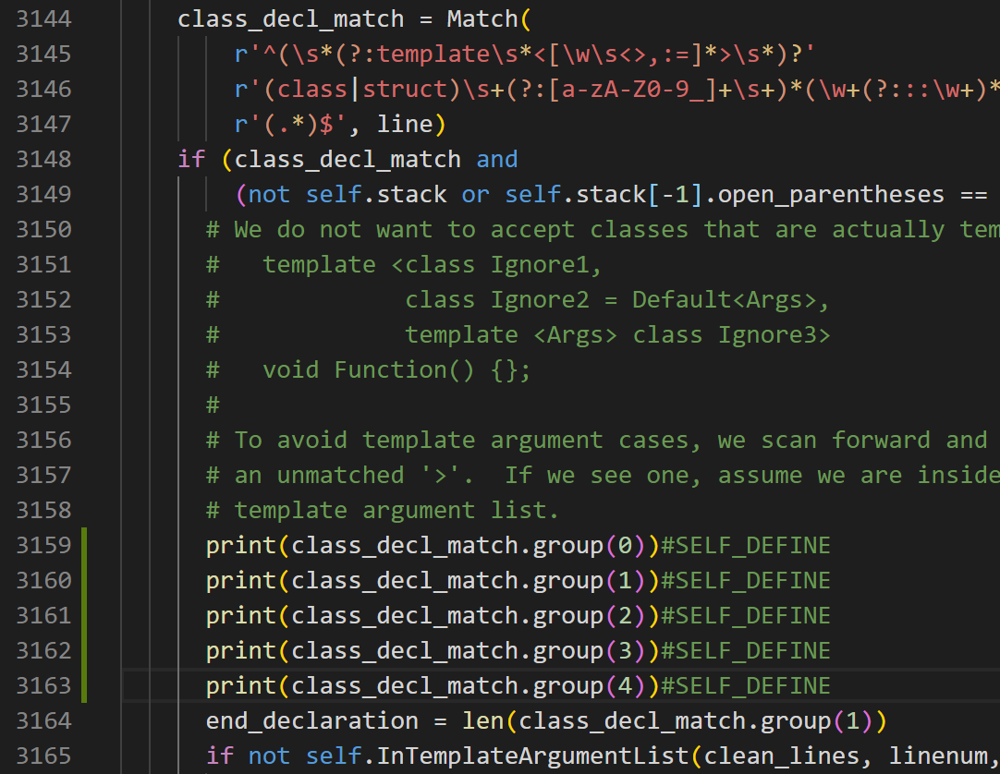

像上图这样测试，出来的结果如下：(写到4就是极限了，再加就会报错)

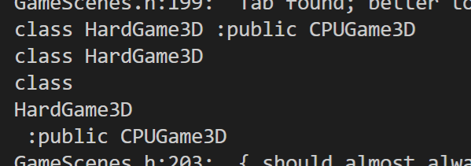

也就是说，group(0)给出全部的匹配结果，group(1)删掉识别到的最后一个组（正则表达式用括号括起来的匹配组，在3145~3147那几行），group(2)是class或struct，group(3)就是类名，group(4)是父类以及继承方式（或许只是未匹配的字符串部分）。

----

Debug手稿

第6362行
```
nesting_state.Update(filename, clean_lines, line, error)
```

当本行识别到class定义时，nesting_state在update完本行后，stack中会多出来一个ClassInfo，但直到这个class定义结束，都不会有新的block加进来。除非在class定义的内部存在多行block定义。像这种（34~37行）：

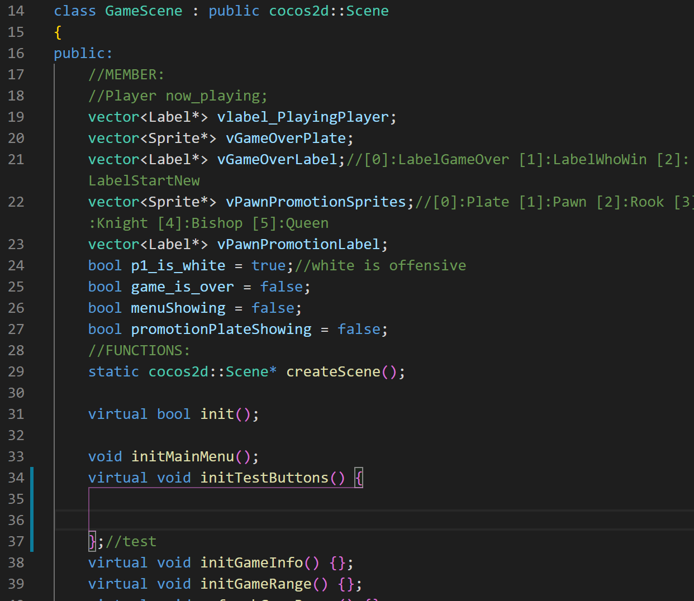

----

最后需要得出的内容示例(json)：
```
[
    {
        "type":"classdef",
        "name":"GameScene",
        "parent":"",
        "member":[
            {
                "type":"int",
                "name":"x"
            },
            {
                "type":"vector<int>",
                "name":"v"
            }
        ],
        "function":[
            {
                "returnType":"void",
                "name":"foo",
                "argv":[]
            },
            ...
            {}
        ]
    },
    ...
    {}
]
```

----

最终定稿，可以实现类名的识别，但并不能有效地识别变量名和函数名。

自定义部位：
- import json
58行附近

- 新定义了一个类，叫做Extraction
6938~6966行附近
```
class Extraction:
  def __init__(self):
    self.json=[]
    self.current=None#当前正在处理的class名称

  def appendClass(self,name,parent,member=[],function=[]):
    pass

  def appendMember(self,varType,name):
    for cl in self.json:
      if cl["name"]==current:
        break
    cl["member"].append({
      "type":varType,
      "name":name
    })

  def appendFunction(self,returnType,name,argv):
    for cl in self.json:
      if cl["name"]==current:
        break
    cl["function"].append({
      "returnType":returnType,
      "name":name,
      "argv":argv
    })
```
最终计划以json格式输出，因此这里有一个类型为列表的成员变量json。输出格式大致如上文所示。
其中三个成员函数都还没用到……

- 将Extraction添加到NestingState中，成为其中的成员
第2923行附近
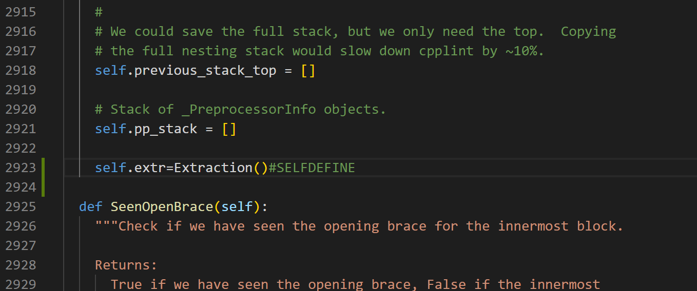

- 在NestingState.Update()中添加需要的操作
在3167~3194行附近
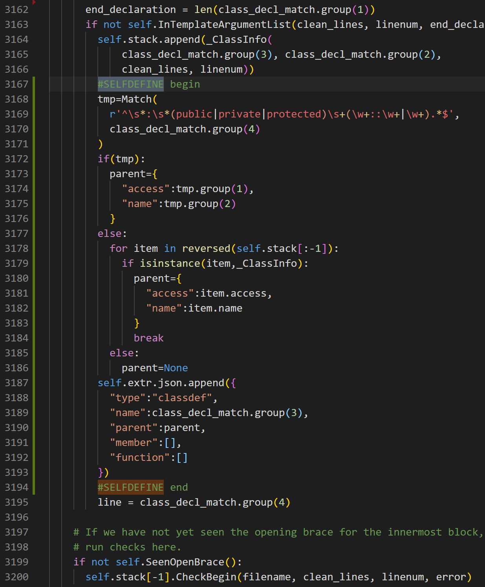
核心修改部位。<br>
先将class_decl_match.group(4)再次进行识别。class_decl_match.group(4)可能是" : public cocos2d::Game2D"这样的情形，也可能是" {"这样的情形。<br>
分类讨论，如果识别class_decl_match.group(4)得到了父类的名称，那么就直接采用，生成一个parent字典；如果未能识别到父类名称，就到stack里面去找，看当前类定义是不是在某个类的代码块内部进行的，如果找到了，那么这就是父类；如果这样还没有找到，则说明这个类没有父类。<br>
最终加入到extr中去。

- 在ProcessFileData()中添加需要的操作
6535~6538行附近
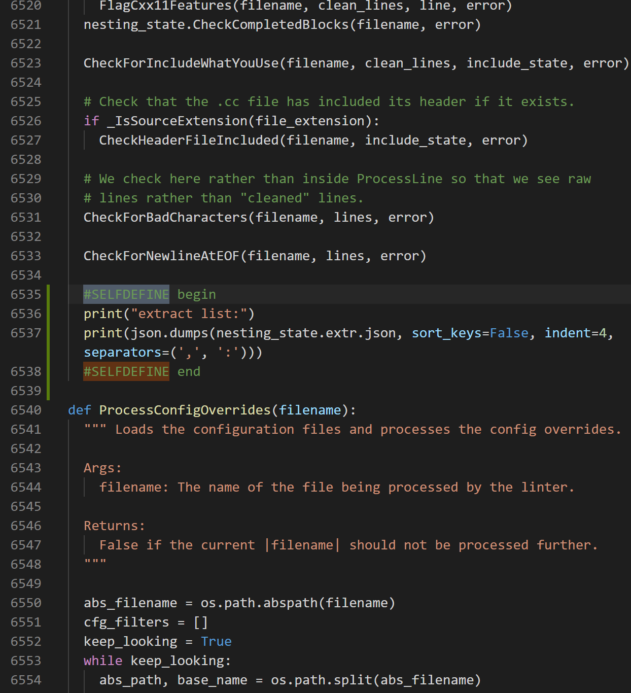
以json格式输出识别结果。如果不使用json格式输出，那么python的print是不会自动添加换行符的，这样看上去很不清晰。

- 在main()中指定文件以及vlevel，以便调试。
- 6915行附近
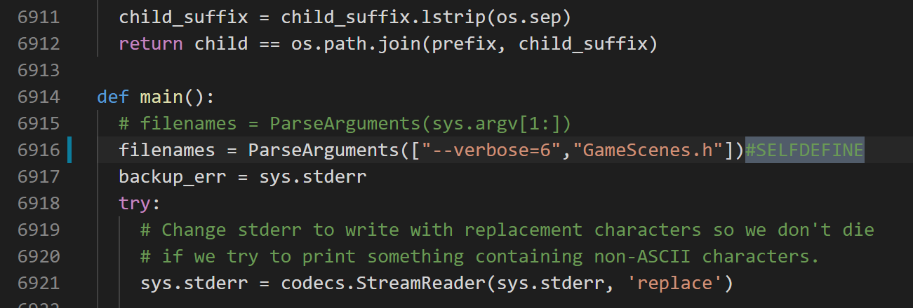
注释掉了原来的一行，并且指定参数为"--verbose=6"，以及文件为"GameScenes.h"。

最终效果：
```
extract list:
[
    {
        "type":"classdef",
        "name":"GameScene",        
        "parent":{
            "access":"public",     
            "name":"cocos2d::Scene"
        },
        "member":[],
        "function":[]
    },
    {
        "type":"classdef",
        "name":"GameScene4D",      
        "parent":{
            "access":"public",
            "name":"GameScene"
        },
        "member":[],
        "function":[]
    },
    {
        "type":"classdef",
        "name":"GameScene2D",
        "parent":null,
        "member":[],
        "function":[]
    },
    {
        "type":"classdef",
        "name":"GameScene3D",
        "parent":{
            "access":"public",
            "name":"GameScene"
        },
        "member":[],
        "function":[]
    },
    {
        "type":"classdef",
        "name":"CPUGame2D",
        "parent":{
            "access":"public",
            "name":"GameScene2D"
        },
        "member":[],
        "function":[]
    },
    {
        "type":"classdef",
        "name":"CPUGame3D",
        "parent":{
            "access":"public",
            "name":"GameScene3D"
        },
        "member":[],
        "function":[]
    },
    {
        "type":"classdef",
        "name":"TwoPlayersGame2D",
        "parent":{
            "access":"public",
            "name":"GameScene2D"
        },
        "member":[],
        "function":[]
    }
]
```