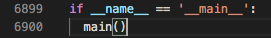

# cpplint提取类成员

总目标，
主要是学习cpplint是如何扫描文件的，包括class的嵌套，还有扫描代码风格，正则表达式提取变量什么的。我的任务是在Cpplint这个文件的基础上，进行一些修改，将头文件(公司里已经写好的.h文件)里面的每个class的变量名提取出来，存到字典里，key是class名（有class嵌套就写成class1:class2类似这种？），value是存放变量的一个数组。如果遇到继承 就把父类也扫描一遍，然后把变量名存起来。

首先我们需要大致了解C++的面向对象语法。这一点暂且跳过。

----
# Main

然后，我们需要寻找cpplint.py中**负责语法解析**的部分。参见"cpplint-副本.py"，这是完整的原版。请勿改动之。

在文件的末尾，有cpplint的入口。但这个入口可能并不涵盖整个文件的所有功能，因为后面了解到，这个main入口主要是命令行调用的时候的程序起始位置，但保不齐这个文件作为一个被import的模块文件还有别的设计。总之先搞清楚main在干嘛。



找到了main的位置：


分析其代码，有关stderr的内容暂且略过，因为这是关于异常情形的，我们目前仅关注正常情形。那么我们不难关注到6876行的ParseArguments()和6885行的ProcessFile()。这两个方法很重要。

----
# ParseArguments

看函数的名字，ParseArguments看上去是分析参数的。而sys.argv又是命令行调用时的参数列表，因而推断这里是负责处理命令行调用方式的代码。

命令行调用，大概就是在bash/cmd中这样调用：
```
python cpplint.py file1 file2 file3...
```
其中file1、file2、file3等就是参数。另外，可能还会有以减号'-'或者双减号'--'开头的配置参数，例如```--help```,```--quiet```等。

查找ParseArgument，发现它的定义在6714～6814行。其中罗列了一些配置参数，如图（不全展示）：


而ParseArgument则是负责分析命令行中除去'python'和'cpplint.py'的其他参数，该改动配置信息的改动配置信息，该记成文件的记进文件列表里面，最后作为函数的返回值返回一个列表（它还排了个序，应该是按字母顺序）：


如此分析下来，最重要的便一定是ProcessFile()了。

----
# ProcessFile


这是main()里面的一段。不难看出，ProcessFile()每次接受一个文件名字符串的输入，并且接受verbose_level这个参数的配置。verbose的本义是“啰嗦的”，这里应该是指输出的重要等级，比如如果这个level设置得很高，那么只有发现了很严重的问题才会显示，不太严重的问题就会被忽略掉。


如上图，6596行也给出了解释。

查找到ProcessFile的位置在6590～6680行。


6612～6613行的两个空列表定义，分别叫lf_lines和crlf_lines。lf和crlf分别是两种行尾。ASCII码表中有两个不可见字符，即回车(CR, ASCII 13, \r) 换行(LF, ASCII 10, \n)。有的文本文件的一行会以一个LF结尾，而有的文本文件的一行会以一个CR加上一个LF结尾，甚至有的文本文件会混用，这将导致很多麻烦。所以ProcessFile这里应该是对此有一定的处理吧。

6614～6644行是一个try-except语句，大致看了一下，大致意思是：<br>
如果文件名是'-'，那么就使用stdin（键盘，或者输入输出流）来输入（输入输出流是什么就不用管了，是一种不常用的用法，学习自动化的时候才会用到，手动用不到的），否则就读取文件。把信息存放在lines这个列表里。（6622～6629）<br>
然后，再根据行尾是什么，用lf_lines和crlf_lines记录lines里面哪些行是lf结尾，哪些行是crlf结尾。lf_lines和crlf_lines并不存储文本，只存储文本的行号。这是从```lf_lines.append(linenum + 1)```看出来的。（6633～6638）<br>
一旦出问题就报错退出。（6640～6644）


再看6647行（上图），这是要解析文件的扩展名，也就是后缀（像.mp3/.jpg/.cpp/.v/.sv/.py/.pdf这种都叫后缀，也都叫扩展名。不过此处允许出现的没有这么多，因为cpp-lint是给c++用的嘛）。

6651～6674是一个if-else语句。<br>
6651～6653行是说，如果filename拿到的并不是'-'（也就是说并不是走stdin给入文本信息，而是从文件中读取），并且这个文件的扩展名还不在GetAllExtensions()给出的列表里面，那就说明这个文件的扩展名不对，是非法的，比如它可能根本就不是C++文件，不应该被cpp-lint处理，于是报错。<br>
6654～6674行则是在上面的分支没有报错时，进行的操作。<br>
看到6655行，看起来ProcessFileData又是一个非常重要的函数，因为凭上下文推断，上文是在作准备，而下文则是在收拾残局，该报错的报错，该输出的输出，所以负责处理的自然是这一条语句了。<br>
6668～6674则是在报错，指出不该用crlf作为行尾。

----

# ProcessFileData

之前分析的发现，其余部分都是在围绕着它做一些后勤工作。聚焦到ProcessFileData。

